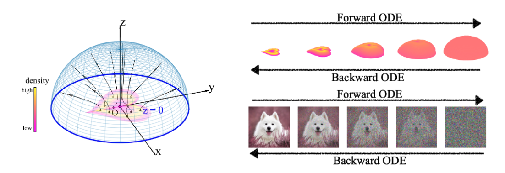

# Poisson Flow Generative Models

Pytorch implementation of the NeurIPS 2022 paper [Poisson Flow Generative Models](https://arxiv.org/abs/2209.11178), 

by [Yilun Xu](http://yilun-xu.com)\*, [Ziming Liu](https://kindxiaoming.github.io/#pub)\*, [Max Tegmark](https://space.mit.edu/home/tegmark/), [Tommi S. Jaakkola](http://people.csail.mit.edu/tommi/)


**Note**: The method has been extended by the subsequent work [PFGM++: Unlocking the Potential of Physics-Inspired Generative Models](https://arxiv.org/abs/2302.04265) ([code](https://github.com/Newbeeer/pfgmpp)) with the following improvements:

😇 *Improvements over PFGM / Diffusion Models:*

- No longer require the large batch training target in *PFGM*, thus enable **flexible conditional generation and more efficient training!**
- More general $D \in \mathbb{R}^+$ dimensional augmented variable. **PFGM++ subsumes PFGM and Diffusion Models**: *PFGM* correspond to $D=1$ and *Diffusion Models* correspond to $D\to \infty$.
- Existence of **sweet spot** $D^*$ in the middle of $(1,\infty)$!
- Smaller $D$ **more robust** than *Diffusion Models* ( $D\to \infty$ )
- Enable the **adjustment for model robustness and rigidity**!
- Enable **direct transfer of well-tuned hyperparameters** from any existing *Diffusion Models* ( $D\to \infty$ )


**Hence, we recommend the [PFGM++](https://github.com/Newbeeer/pfgmpp) framework for new projects.**

---


We propose a new **Poisson flow** generative model (**PFGM**) that maps a uniform distribution on a high-dimensional hemisphere into any data distribution. We interpret the data points as electrical charges on the $z=0$ hyperplane in a space augmented with an additional dimension $z$, generating a high-dimensional electric field (the gradient of the solution to Poisson equation). We prove that if these charges flow upward along electric field lines, their initial distribution in the $z=0$ plane transforms into a distribution on the hemisphere of radius $r$ that becomes *uniform* in the $r \to\infty$ limit. To learn the bijective transformation, we estimate the normalized field {in the augmented space}. For sampling, we devise a backward ODE that is anchored by the physically meaningful additional dimension: the samples hit the (unaugmented) data manifold when the $z$ reaches zero. 



Experimentally, PFGM achieves **current state-of-the-art** performance among the normalizing flow models on CIFAR-10, with an Inception score of **9.68** and a FID score of **2.35**. It also performs on par with the state-of-the-art SDE approaches **(e.g., score-based SDEs or Diffusion models)** while offering **10x** to **20x** acceleration on image generation tasks. Additionally, PFGM appears more tolerant of estimation errors on a weaker network architecture and robust to the step size in the Euler method, and capable of scale-up to higher resolution datasets.

---


*Acknowledgement:* Our implementation relies on the repo https://github.com/yang-song/score_sde_pytorch. 

## Dependencies

We provide two solutions to install a subset of necessary python packages for our code. Please find the best fit for you.

1. The old dependency in repo https://github.com/yang-song/score_sde_pytorch

```sh
pip install -r requirements_old.txt
```

2. Our dependency (Python 3.9.12, CUDA Version 11.6)

```sh
pip install -r requirements.txt
```


## Usage

Train and evaluate our models through `main.py`.

```sh
python3 main.py:
  --config: Training configuration.
  --eval_folder: The folder name for storing evaluation results
    (default: 'eval')
  --mode: <train|eval>: Running mode: train or eval
  --workdir: Working directory
```

For example, to train a new PFGM w/ DDPM++ model on CIFAR-10 dataset, one could execute 

```sh
python3 main.py --config ./configs/poisson/cifar10_ddpmpp.py --mode train \
--workdir poisson_ddpmpp
```

* `config` is the path to the config file. The prescribed config files are provided in `configs/`. They are formatted according to [`ml_collections`](https://github.com/google/ml_collections) and should be quite self-explanatory.

  **Naming conventions of config files**: the path of a config file is a combination of the following dimensions:

  - Method: :star2:**PFGM**:   `poisson`;  **Score-based models** :  `ve`, `vp`, `sub_vp`

  *  dataset: One of `cifar10`, `celeba64`, `celebahq_256`, `ffhq_256`, `celebahq`, `ffhq`.
  * model: One of `ncsnpp`, `ddpmpp`.
  * continuous: train the model with continuously sampled time steps (only for score-based models). 

  :star2:**Important Note 1** : We use a large batch (e.g. current `training.batch_size=4096` for CIFAR-10, ~25G GPU memory usage) to calculate the Poisson field for each mini-batch samples (e.g. `training.small_batch_size=128` for CIFAR-10). To adjust GPU memory cost, please modify the `training.batch_size` parameter in the config files. 

  :star2:**Important Note 2** : If `rk45` solver exibits unstability for your dataset/neural network, please try to use the forward Euler method or Improved Euler method by modifying the `config.sampling.ode_solver` parameter to `forward_euler` or `improved_euler`. 

  Please set some key hyper-parameters for specific dataset by running

  ```shell
  python3 hyper-parameters.py 
  	--data_norm: Average data norm of the dataset 
  	--data_dim: Data dimension
  ```

  We also list a few other useful tips in [Tips section](#tips).

*  `workdir` is the path that stores all artifacts of one experiment, like checkpoints, samples, and evaluation results.

* `eval_folder` is the name of a subfolder in `workdir` that stores all artifacts of the evaluation process, like meta checkpoints for pre-emption prevention, image samples, and numpy dumps of quantitative results.

* `mode` is either "train" or "eval". When set to "train", it starts the training of a new model, or resumes the training of an old model if its meta-checkpoints (for resuming running after pre-emption in a cloud environment) exist in `workdir/checkpoints-meta` .

* Below are the list of evalutation command-line flags:

  `--config.eval.enable_sampling`: Generate samples and evaluate sample quality, measured by FID and Inception score. 

   `--config.eval.enable_bpd` : Compute log-likelihoods

   `--config.eval.dataset=train/test` : Indicate whether to compute the likelihoods on the training or test dataset.

   `--config.eval.enable_interpolate` : Image Interpolation

   `--config.eval.enable_rescale` : Temperature scaling


## Tips

- :star2:**Important** : We use a large batch (e.g. current `training.batch_size=4096` for CIFAR-10, ~25G GPU memory usage) to calculate the Poisson field for each mini-batch samples (e.g. `training.small_batch_size=128` for CIFAR-10). To adjust GPU memory cost, please modify the `training.batch_size` parameter in the config files. 

- :star2: **How to set the hyper-parameters** :  The prior distribution on the $z=z_{max}$ hyperplane is a long-tail distribution. We recommend clipping the sample norm by the hyper-parameters `sampling.upper_norm`. Please refer to `Appendix B.1.1 `  and `Appendix B.2.1` in the paper (https://arxiv.org/abs/2209.11178) for our recommended setups for hyper-parameters `training.M`, `sampling.z_max` and `sampling.upper_norm` for general datasets.

  We provide a script for easily calculating those hyper-parameters:

  ```shell
  python3 hyper-parameters.py 
  	--data_norm: Average data norm of the dataset 
  	--data_dim: Data dimension
  ```

- If `rk45` solver exibits unstability for your dataset/neural network, please try to use the forward Euler method or Improved Euler method by modifying the `config.sampling.ode_solver` parameter to `forward_euler` or `improved_euler`. 

- TODO

  

## Checkpoints

Please place the pretrained checkpoints under the directory `workdir/checkpoints`, e.g., `cifar10_ddpmpp/checkpoints`.  

To generate and evaluate the FID/IS of  (10k) samples of the PFGM w/ DDPM++ model, you could execute:

```shell
python3 main.py --config ./configs/poisson/cifar10_ddpmpp.py --mode eval \ 
--workdir cifar10_ddpmpp --config.eval.enable_sampling --config.eval.num_samples 10000
```

To only generate and visualize 100 samples of the PFGM w/ DDPM++ model, you could execute:

```shell
python3 main.py --config ./configs/poisson/cifar10_ddpmpp.py --mode eval \ 
--workdir cifar10_ddpmpp --config.eval.enable_sampling --config.eval.save_images --config.eval.batch_size 100
```

The samples will be saved to `cifar10_ddpmpp/eval/ode_images_{ckpt}.png`.


All checkpoints are provided in this [Google drive folder](https://drive.google.com/drive/folders/1v4u0OhZ0rxjgch51pZLySztMQATQQOeK?usp=sharing).

| Dataset              | Checkpoint path                                              |    Invertible?     |  IS  |  FID  | NFE (RK45) |
| -------------------- | :----------------------------------------------------------- | :----------------: | :--: | :---: | :--------: |
| CIFAR-10             | [`poisson/cifar10_ddpmpp/`](https://drive.google.com/drive/folders/1UBRMPrABFoho4_laa4VZW733RJ0H_TI0?usp=sharing) | :heavy_check_mark: | 9.65 | 2.48  |    ~104    |
| CIFAR-10             | [`poisson/cifar10_ddpmpp_deep/`](https://drive.google.com/file/d/1BeJGD0WP230u8nkHEWqywOvhH2_5F-Q0/view?usp=sharing) | :heavy_check_mark: | 9.68 | 2.35  |    ~110    |
| LSUN bedroom $256^2$ | [`poisson/bedroom_ddpmpp/`](https://drive.google.com/drive/folders/1uFmlcBTQmUI_ZfyUiYoR54H4V2uBsuS7?usp=sharing) | :heavy_check_mark: |  -   | 13.66 |    ~122    |
| CelebA $64^2$        | [`poisson/celeba_ddpmpp/`](https://drive.google.com/drive/folders/1LjplqjwIfZbp6LeK3_M2rIW-CaVhgn6p?usp=sharing) | :heavy_check_mark: |  -   | 3.68  |    ~110    |


### FID statistics

Please find the statistics for FID scores in the following links:

[CIFAR-10](https://drive.google.com/file/d/1YyympxZ95l6_ane0TxYt94yqeiGcOBNG/view?usp=sharing),  [CelebA 64](https://drive.google.com/file/d/1dzSsmBvJOjDy12VzdypWDVYBF8b9yRkm/view?usp=sharing), [LSUN bedroom 256](https://drive.google.com/file/d/16zTW5DhwmK4Hl-Vhez9LDyqN-CXi4Lhi/view?usp=sharing)


<center></center>


